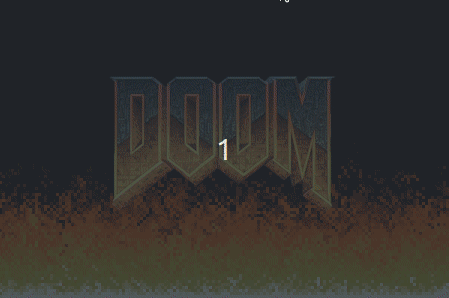

# 🔥 DOOM FIRE 🔥

Tela de início do Doom usando python e pygame



Este projeto foi baseado no [artigo](https://medium.com/@FilipeDeschamps/tutorial-completo-de-como-implementar-o-algoritmo-do-fogo-do-doom-41d38ac39fa7) do Filipe Deschamps. 

## Criando o ambiente virtual

Você pode optar por utilizar um ambiente virtual (recomendo fortemente) ou não (siga para [Instalação](#install)), caso escolha utilizar e ja tenha instalado o virtualenv, execute o comando a seguir:

``` 
    $ python -m virtualenv .venv 
```

Isso criará um diretório oculto chamado .venv na raíz do projeto que é responsável por "encapsular" o python específicamente para aquele diretório. Caso queira entender melhor como o virtualenv funciona, veja o [link](https://virtualenv.pypa.io/en/latest/).

Em seguida é necessário ativar o ambiente virtual para que toda execução de comandos e interpretação seja feita através dele.

Caso esteja em um ambiente baseado em unix (linux ou macos) execute:

```
    $ source .venv/bin/activate 
```

Caso esteja utilizando uma plataforma windows, execute:

``` 
    .venv/scripts/Active 
```

Por fim, quando precisar desativar seu ambiente virtual, execute:

```
    $ deactivate 
```

## Instalação <a name="install"></a>

Para instalar os pacotes necessários para a execução do projeto, execute o comando a seguir:

``` 
    pip install -r requirements.txt 
```

## Execução 

Com a instalação feita, os arquivos devem seguir a seguinte estrutura dentro do diretório root:

```
.
├── app
│   ├── app.py
│   ├── collor_pallet.py
│   ├── doom_fire.py
│   └── doom-logo.png
├── README.md
└── requirements.txt
```

Com isso, basta entrar no diretório *app* e executar o arquivo *app.py* , com os seguinte comandos:

``` 
    $ cd app/  && python app.py
```

